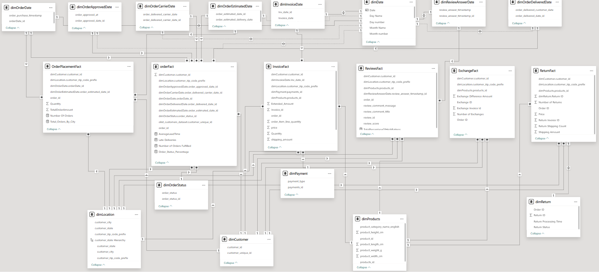
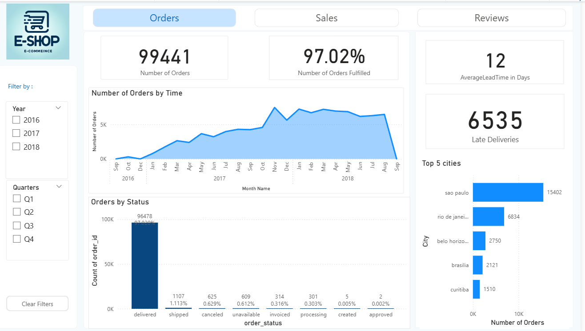
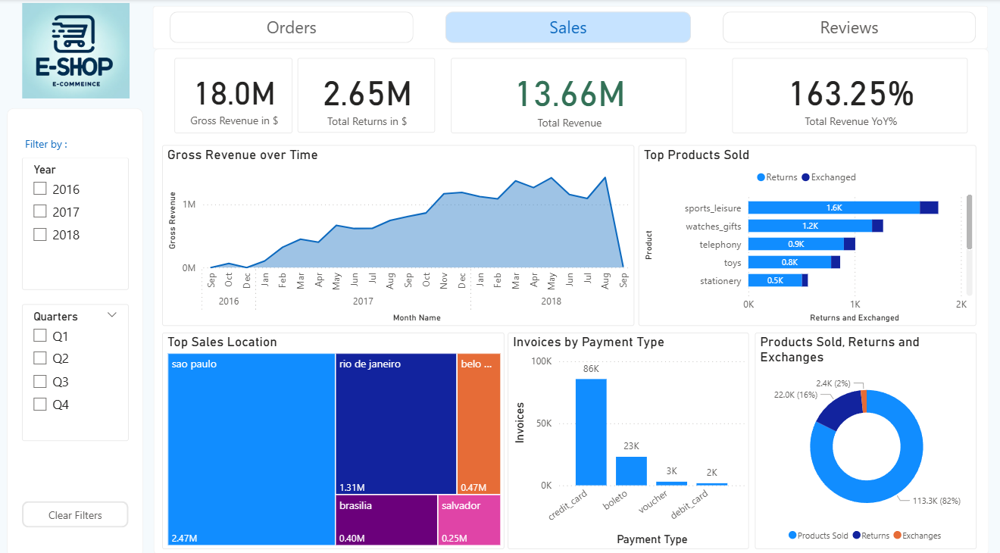
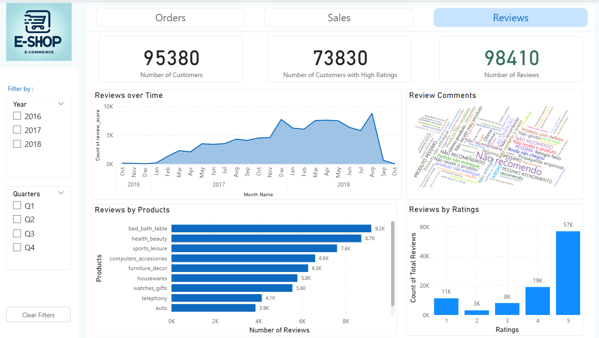

# E-Commerce-Dimensional-Modelling-And-Data-Analysis
This project presents a comprehensive analysis and data modeling workflow to understand and optimize the order management processes of an E-Commerce business. Leveraging the [Brazilian E-Commerce Public Dataset by Olist](https://www.kaggle.com/datasets/olistbr/brazilian-ecommerce), the study evaluates operational performance across five core business functions and builds an efficient Power BI data model to support data-driven decision-making.

## Project Overview
E-commerce operations involve multiple interconnected processes—from order placement to customer feedback. This project aims to uncover performance patterns, identify bottlenecks, and propose actionable improvements by analyzing real-world data.

The analysis is centered around the following business processes:

- Order Placement
- Order Fulfillment & Shipment
- Invoicing & Payments
- Exchanges & Returns
- Customer Reviews & Feedback

A scalable Power BI semantic model was designed to support these analyses using industry-standard modeling practices.

## Methodology
This project used a structured workflow to convert raw e-commerce data into meaningful business insights:

**Data Evaluation and Acquisition**: Reviewed all available datasets and identified the key metrics needed to address business goals. Gathered information from various systems such as CRM, ERP, and web analytics tools.

**Data Preparation and Transformation**: Utilized Power Query to clean and standardize data, remove duplicates, and manage missing entries. Developed a reliable ETL pipeline to maintain data accuracy and consistency throughout the model.

**Dimensional Data Modeling**: Built a star schema model featuring well-defined fact and dimension tables to enhance analytical performance. Configured relationships and hierarchies to support detailed, multi-layered analysis.

**Measure Creation**: Developed advanced DAX measures to compute essential KPIs, basket analysis indicators, and year-over-year comparison metrics.

**Dashboard & Visualization Development**: Followed visualization best practices to design clear, user-friendly dashboards. Selected appropriate chart types and applied strong visual structure to ensure insights are easy to interpret.

## Tools and Technologies

**Power BI Desktop**:  Data modeling and visualization

**DAX**: Measures and calculations

**Power Query (M Language)**: Data cleaning and transformations

## Data Modeling in Power BI

The data model was developed in Microsoft Power BI, focusing on clean schema design, optimized relationships, and analytical flexibility.

**Data Modeling Highlights**

- Used consistent naming conventions for surrogate keys (e.g., SK_OrderID, SK_CustomerID).

- Designed a centralized Calendar Table, enabling accurate date-driven analysis across all facts.

- Built optimized Star Schema structures separating Fact and Dimension tables.

- Ensured model efficiency through:
  - proper column data types
  - reduction of cardinality
  - removal of unused columns
  - performance-oriented DAX calculations

## Key Insights
1. Order volume grew steadily to 99,441 orders over three years—with an average 20% annual increase, peak monthly sales in late Q4, consistently strong performance in São Paulo, and clear opportunities to boost year-round sales and geographic expansion through targeted marketing.
2. While delivery rates and lead times improved over the years, the sharp rise in late deliveries and the fluctuations in cancelled or unavailable orders highlight significant operational gaps that risk customer satisfaction and require urgent, sustained process improvements.
3. Invoice analysis reveals $13.66M in revenue from 113K products over two years, with strong seasonal demand peaking in Q2, top sales concentrated in Sao Paulo and Rio de Janeiro, and consistently high-performing categories like sports, watches, and telephony—providing clear guidance for inventory planning, targeted promotions, and optimized fulfillment.
4. Despite strong sales in key categories, high exchange and return rates—especially in sports leisure, watches, and telephony—reveal significant post-purchase dissatisfaction, underscoring the need for improved product clarity, targeted customer feedback, and refined post-sales strategies to strengthen overall customer experience.
Customer feedback analysis shows a strong upward trend in satisfaction—rising from 193 positive reviews in 2016 to over 43K in 2018—highlighting effective service improvements, high engagement in key product categories, and clear opportunities to further refine customer experience strategies amid a slight dip in 5-star ratings.

## Data Model and Dashboards

